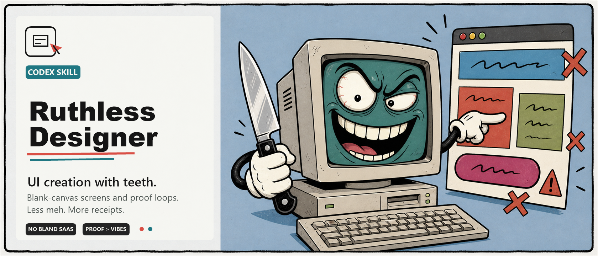

# Ruthless Designer



> A Codex skill for blank-canvas UI creation with teeth: complete product screens, dashboards, landing pages, prototypes, visual systems, obsessive critique/fix/proof loops, and visual QA.

[](./LICENSE)
[](#status)

Ruthless Designer is for moments where "make it nice" is not enough. It creates or reimagines interfaces from first principles, rejects generic defaults, defines a visual system, builds the artifact when code is available, and keeps cutting until the design survives evidence.

Use it for:

- greenfield app screens, dashboards, tools, prototypes, and product flows
- new landing pages, portfolios, launch pages, and visual systems
- broad redesign direction when the old surface is not worth polishing
- reference-led UI creation from screenshots, URLs, videos, images, or brand assets
- obsessive visual QA before a design or implementation is called good

It is intentionally severe. A result that could fit a competitor after swapping the logo fails. A design without state coverage fails. A claim without screenshot, diff, command output, source artifact, or explicit blocker fails.

## What Makes It Different

- `greenfield-design.md` forces a real product read before layout.
- `obsessive-design-loop.md` brings artifact-first persistence: critique/fix/proof loops, side-by-side evidence, first-impression gates, state coverage, direction resets, and a Loop 30 continue/ask/stop verdict for broad missions.
- `visual-qa.md` compares source truth against rendered result instead of blessing vibes.
- The bundled review harness and detector create local evidence packs for static and runtime UI review.

## Install

Copy the skill folder into your Codex skills directory:

```powershell
Copy-Item -Recurse .\SKILLS\ruthless-designer "$env:USERPROFILE\.codex\skills\ruthless-designer"
```

If `CODEX_HOME` is set, install there instead:

```powershell
Copy-Item -Recurse .\SKILLS\ruthless-designer "$env:CODEX_HOME\skills\ruthless-designer"
```

## Usage

Invoke it by name or ask for work that clearly matches it:

```text
Use ruthless-designer to create a complete dashboard for a studio booking tool.
```

```text
Design a landing page from scratch. Be ruthless: no generic SaaS hero, include states and proof.
```

```text
Create a new visual direction for this product from the screenshots and implement the first screen.
```

For targeted cleanup of existing implemented UI, use a focused improvement skill when available. Ruthless Designer can still inspect existing surfaces, but its strongest mode is invention and broad reimagination.

## Useful Commands

Validate the skill package:

```powershell
npm run validate
```

Run the static smoke review against the intentionally bad fixture:

```powershell
npm run smoke
```

Run both:

```powershell
npm run check
```

Run the harness against a target project:

```powershell
node .\SKILLS\ruthless-designer\scripts\run-interface-review.mjs --path <frontend-path> --out .scratch\ruthless-designer\<slug> --fail-on=P2
```

Add a local URL when the UI is runnable:

```powershell
node .\SKILLS\ruthless-designer\scripts\run-interface-review.mjs --path <frontend-path> --url http://localhost:5173 --out .scratch\ruthless-designer\<slug> --fail-on=P1
```

## Project Structure

- [`SKILLS/ruthless-designer/SKILL.md`](./SKILLS/ruthless-designer/SKILL.md): trigger contract and router.
- [`greenfield-design.md`](./SKILLS/ruthless-designer/greenfield-design.md): blank-canvas design process.
- [`obsessive-design-loop.md`](./SKILLS/ruthless-designer/obsessive-design-loop.md): persistence and evidence gates.
- [`visual-qa.md`](./SKILLS/ruthless-designer/visual-qa.md): source-vs-rendered comparison.
- [`scripts/`](./SKILLS/ruthless-designer/scripts): static detector and review harness.
- [`fixtures/`](./SKILLS/ruthless-designer/fixtures): intentionally bad UI fixture for smoke tests.

## Status

Preview public skill project.

- The skill validates without external dependencies.
- Static review smoke runs with Node.js only.
- Runtime browser proof requires Playwright in the target project or an available Playwright path.

## License

MIT.
